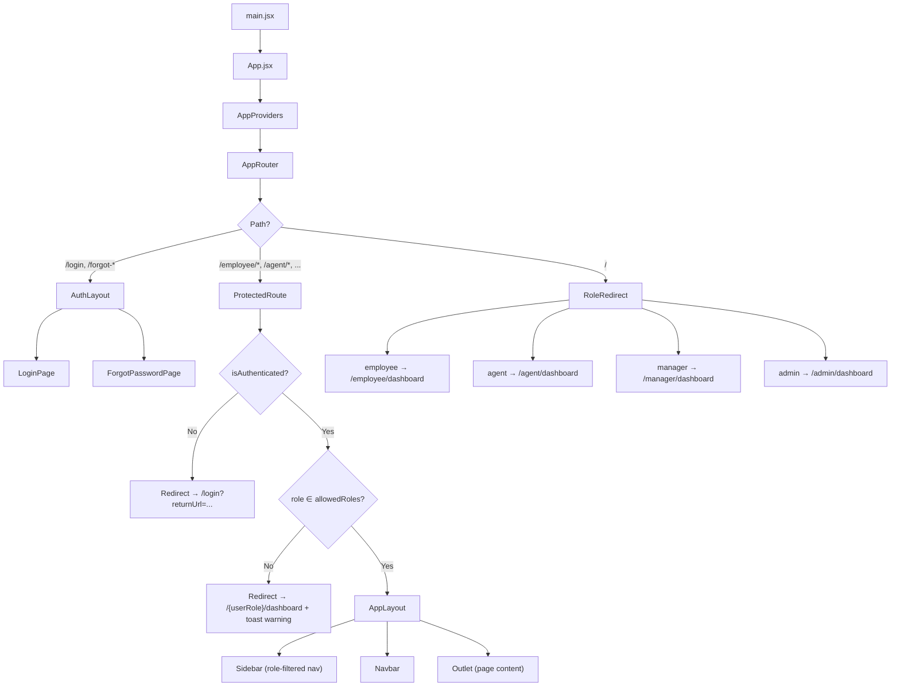
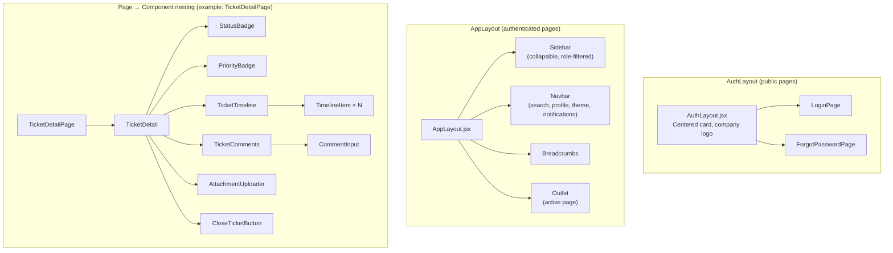
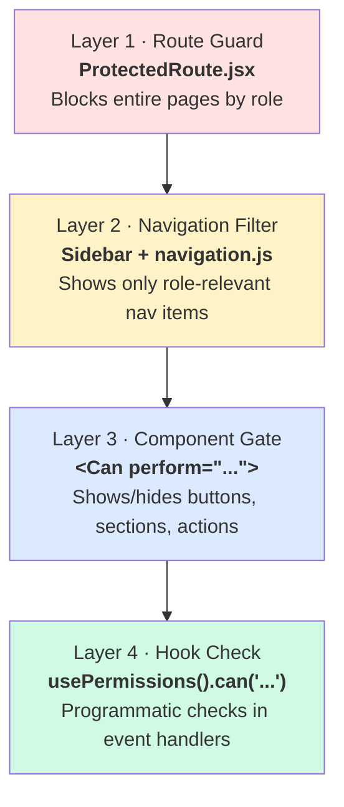
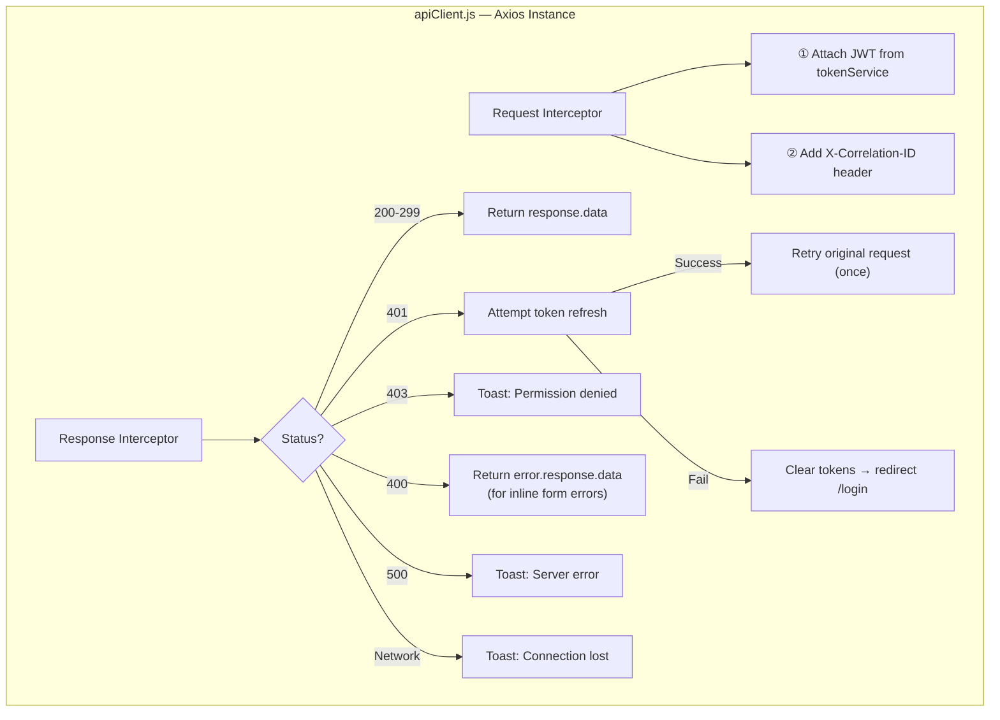
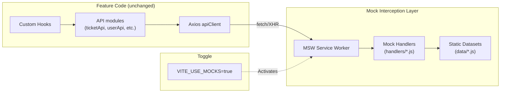
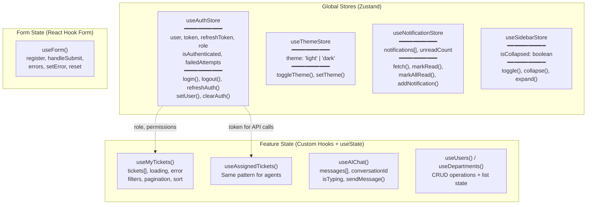

# Enterprise Service Desk Agent — Frontend Architecture Plan (v2)

> **Aligned with:** BA Document (Team J – Enterprise Service Desk Agent)
> **Tech Stack:** React 18 + Vite · JavaScript · Tailwind CSS v3 · React Router DOM v6 · Axios · Zustand · React Hook Form · React Toastify · Recharts · React Icons

---

## Confirmed Decisions

| Decision | Choice |
|----------|--------|
| Tailwind CSS | **v3** (class-based, `darkMode: 'class'`) |
| State Management | **Zustand** (~1 KB, selector-based re-renders, persistence middleware) |
| Authentication | **JWT** with refresh token rotation + `Remember Me` via `localStorage` |
| Real-time | **WebSocket-ready** architecture (mocked via polling for MVP, upgradeable) |
| Backend | **None yet** — Full mock-first strategy with MSW + static datasets |
| MFA | **UI placeholder** (toggle in settings, OTP input component) — backend-dependent |

---

## BA Alignment: Functional Requirement → Component Traceability

### Authentication Module (FR-001 → FR-007)

| FR ID | Requirement | Frontend Component | User Story |
|-------|------------|-------------------|------------|
| FR-001 | User Login | `LoginForm.jsx` → `LoginPage.jsx` | US-001 |
| FR-002 | User Logout | `Navbar.jsx` (profile dropdown → logout) | — |
| FR-003 | Password Reset | `ForgotPasswordForm.jsx` → `ForgotPasswordPage.jsx` | US-002 |
| FR-004 | Session Timeout (30 min) | `useSessionTimeout.js` hook + `SessionExpiredModal.jsx` | — |
| FR-005 | JWT Authentication | `tokenService.js` + `apiClient.js` interceptors | — |
| FR-006 | Multi-Factor Authentication | `MFAInput.jsx` (OTP entry, UI placeholder) | — |
| FR-007 | Role-Based Access Control | `ProtectedRoute.jsx` + `Can.jsx` + `permissions.js` | US-003 |

### AI Assistant Module (FR-008 → FR-013)

| FR ID | Requirement | Frontend Component | User Story |
|-------|------------|-------------------|------------|
| FR-008 | Natural Language Chat | `ChatWindow.jsx` + `ChatInput.jsx` | US-004 |
| FR-009 | Context-Aware Conversations | `useAIChat.js` (maintains conversation context array) | US-004 |
| FR-010 | Knowledge Base Search | `KBSearch.jsx` + AI integration in `ChatWindow` | US-005 |
| FR-011 | Suggested Solutions | `SuggestedQuestions.jsx` (rendered in chat + ticket view) | US-004 |
| FR-012 | Escalation Support | `EscalationPrompt.jsx` within chat → auto-creates ticket | US-007 |
| FR-013 | Conversation History | `ChatHistory.jsx` + `ChatHistorySidebar.jsx` | US-006 |

### Ticket Management Module (FR-014 → FR-024)

| FR ID | Requirement | Frontend Component | User Story |
|-------|------------|-------------------|------------|
| FR-014 | Create Ticket | `CreateTicketForm.jsx` | US-008 |
| FR-015 | Auto Ticket ID Generation | Mock utility: `generateTicketId()` → `TKT-2026-XXXXX` | US-008 |
| FR-016 | Upload Attachments | `AttachmentUploader.jsx` (drag-and-drop) | US-009 |
| FR-017 | View Ticket Status | `TicketDetail.jsx` + `StatusBadge.jsx` | US-010 |
| FR-018 | Update Ticket | `TicketComments.jsx` + `CommentInput.jsx` | US-011 |
| FR-019 | Close Ticket | `CloseTicketButton.jsx` in `TicketDetail.jsx` | US-012 |
| FR-020 | Auto Category Detection | `useCategoryDetection.js` (keyword → category map) | — |
| FR-021 | Auto Priority Assignment | `usePriorityAssignment.js` (rule engine) | — |
| FR-022 | Auto Routing | `useAutoRouting.js` (category → team map) | — |
| FR-023 | Ticket Assignment | `ReassignModal.jsx` (Agent) | US-015 |
| FR-024 | Resolution Tracking | `TicketTimeline.jsx` + resolution timestamp display | — |

### Knowledge Base Module (FR-025 → FR-031)

| FR ID | Requirement | Frontend Component | User Story |
|-------|------------|-------------------|------------|
| FR-025 | Search Articles | `KBSearch.jsx` + `SearchBar.jsx` | US-017 |
| FR-026 | View Articles | `KBArticleView.jsx` | US-017 |
| FR-027 | Categorized Documents | `KBCategoryNav.jsx` + `KBArticleList.jsx` | US-017 |
| FR-028 | AI Retrieval | Integrated in `ChatWindow.jsx` responses | US-005 |
| FR-029 | Create Article | `KBArticleEditor.jsx` (Admin) | US-018 |
| FR-030 | Edit Article | `KBArticleEditor.jsx` (edit mode, Admin) | US-019 |
| FR-031 | Delete Article | `KBManagement.jsx` (delete with confirmation, Admin) | US-020 |

### Notification Module (FR-032 → FR-036)

| FR ID | Requirement | Frontend Component | User Story |
|-------|------------|-------------------|------------|
| FR-032 | Ticket Created | `NotificationItem.jsx` (type: `ticket_created`) | US-021 |
| FR-033 | Ticket Assigned | `NotificationItem.jsx` (type: `ticket_assigned`) | US-022 |
| FR-034 | Ticket Updated | `NotificationItem.jsx` (type: `ticket_updated`) | US-022 |
| FR-035 | Ticket Resolved | `NotificationItem.jsx` (type: `ticket_resolved`) | US-023 |
| FR-036 | Ticket Closed | `NotificationItem.jsx` (type: `ticket_closed`) | US-023 |

### Analytics Module (FR-037 → FR-042)

| FR ID | Requirement | Frontend Component | User Story |
|-------|------------|-------------------|------------|
| FR-037 | Open Ticket Count | `StatCard.jsx` on Manager Dashboard | US-024 |
| FR-038 | Closed Ticket Count | `StatCard.jsx` on Manager Dashboard | US-024 |
| FR-039 | Avg Resolution Time | `ResolutionTimeChart.jsx` (Recharts) | US-024 |
| FR-040 | SLA Compliance | `SLAGaugeChart.jsx` + `SLAMonitorPanel.jsx` | US-026 |
| FR-041 | Agent Performance | `AgentPerformanceTable.jsx` + `AgentWorkloadChart.jsx` | US-024 |
| FR-042 | Export Reports | `ExportControls.jsx` (PDF + Excel) | US-025 |

---

## 1. Complete Folder Structure

```
enterprise-service-desk/
├── public/
│   ├── favicon.ico
│   ├── logo.svg
│   └── manifest.json
│
├── src/
│   ├── app/                                # App-level orchestration
│   │   ├── App.jsx                         # Root: wraps providers + router
│   │   ├── providers/
│   │   │   ├── AppProviders.jsx            # Composes all providers
│   │   │   ├── ThemeProvider.jsx           # Dark/Light class on <html>
│   │   │   └── NotificationProvider.jsx    # In-app notification polling/WS
│   │   ├── router/
│   │   │   ├── AppRouter.jsx               # Central route tree
│   │   │   ├── routes.js                   # Route config: { path, element, roles }
│   │   │   ├── ProtectedRoute.jsx          # Auth guard + RBAC check
│   │   │   └── RoleRedirect.jsx            # Post-login: role → dashboard path
│   │   └── store/                          # Zustand global stores
│   │       ├── useAuthStore.js             # user, token, role, login(), logout()
│   │       ├── useThemeStore.js            # theme, toggleTheme()
│   │       ├── useNotificationStore.js     # notifications[], unreadCount
│   │       └── useSidebarStore.js          # collapsed state
│   │
│   ├── features/
│   │   │
│   │   ├── auth/                           # ── Epic 1: Authentication ──
│   │   │   ├── components/
│   │   │   │   ├── LoginForm.jsx           # Email + Password + Remember Me
│   │   │   │   ├── ForgotPasswordForm.jsx  # Email input + submit
│   │   │   │   ├── PasswordInput.jsx       # Visibility toggle (eye icon)
│   │   │   │   ├── RememberMeCheckbox.jsx
│   │   │   │   ├── MFAInput.jsx            # OTP input (6-digit, UI placeholder)
│   │   │   │   └── SessionExpiredModal.jsx # Auto-show on 30-min timeout
│   │   │   ├── pages/
│   │   │   │   ├── LoginPage.jsx           # Company logo + LoginForm
│   │   │   │   └── ForgotPasswordPage.jsx
│   │   │   ├── hooks/
│   │   │   │   ├── useLogin.js             # Login logic + failed attempt counter
│   │   │   │   ├── useForgotPassword.js
│   │   │   │   └── useSessionTimeout.js    # 30-min inactivity timer (FR-004)
│   │   │   ├── api/
│   │   │   │   └── authApi.js
│   │   │   ├── validation/
│   │   │   │   └── authSchemas.js          # RHF validation: email format, pw rules
│   │   │   └── index.js
│   │   │
│   │   ├── employee/                       # ── Epics 2, 3, 5, 6 (Employee view) ──
│   │   │   ├── components/
│   │   │   │   ├── dashboard/
│   │   │   │   │   ├── EmployeeDashboard.jsx   # Welcome msg, stat cards, quick actions
│   │   │   │   │   ├── WelcomeHeader.jsx       # "Welcome back, {name}"
│   │   │   │   │   ├── QuickActions.jsx        # Create Ticket, AI Chat shortcuts
│   │   │   │   │   ├── RecentTickets.jsx       # Last 5 tickets mini-list
│   │   │   │   │   └── TicketSummaryCards.jsx  # Open / Resolved / Pending counts
│   │   │   │   ├── tickets/
│   │   │   │   │   ├── CreateTicketForm.jsx    # Title, Desc, Category, Priority, Attach
│   │   │   │   │   ├── TicketList.jsx          # Filterable, sortable, paginated
│   │   │   │   │   ├── TicketDetail.jsx        # Full ticket view with timeline
│   │   │   │   │   ├── TicketTimeline.jsx      # Status change + comment history
│   │   │   │   │   ├── TicketComments.jsx      # Comment thread display
│   │   │   │   │   ├── CommentInput.jsx        # Add comment textarea
│   │   │   │   │   ├── CloseTicketButton.jsx   # Close with confirmation
│   │   │   │   │   ├── AttachmentUploader.jsx  # Drag-and-drop + file list
│   │   │   │   │   ├── CharacterCounter.jsx    # For description field
│   │   │   │   │   └── DraftIndicator.jsx      # Auto-save draft status
│   │   │   │   ├── ai-assistant/
│   │   │   │   │   ├── ChatWindow.jsx          # Main chat container
│   │   │   │   │   ├── ChatMessage.jsx         # Single message bubble (user/AI)
│   │   │   │   │   ├── ChatInput.jsx           # Message input + send button
│   │   │   │   │   ├── SuggestedQuestions.jsx  # Clickable suggestion chips
│   │   │   │   │   ├── ChatHistory.jsx         # List of past conversations
│   │   │   │   │   ├── ChatHistorySidebar.jsx  # Sidebar panel for history
│   │   │   │   │   ├── TypingIndicator.jsx     # Animated "AI is typing..."
│   │   │   │   │   ├── EscalationPrompt.jsx    # "Create ticket?" after failed AI
│   │   │   │   │   └── KBResultInChat.jsx      # KB article card within chat
│   │   │   │   └── knowledge-base/
│   │   │   │       ├── KBSearch.jsx            # Search bar + results
│   │   │   │       ├── KBCategoryNav.jsx       # Category sidebar/tabs
│   │   │   │       ├── KBArticleList.jsx       # Article cards grid/list
│   │   │   │       └── KBArticleView.jsx       # Full article reader
│   │   │   ├── pages/
│   │   │   │   ├── EmployeeDashboardPage.jsx
│   │   │   │   ├── CreateTicketPage.jsx
│   │   │   │   ├── MyTicketsPage.jsx
│   │   │   │   ├── TicketDetailPage.jsx
│   │   │   │   ├── AIChatPage.jsx
│   │   │   │   ├── KnowledgeBasePage.jsx
│   │   │   │   └── NotificationsPage.jsx
│   │   │   ├── hooks/
│   │   │   │   ├── useMyTickets.js
│   │   │   │   ├── useCreateTicket.js
│   │   │   │   ├── useTicketDetail.js
│   │   │   │   ├── useAIChat.js                # Manages conversation context
│   │   │   │   ├── useKnowledgeBase.js
│   │   │   │   ├── useCategoryDetection.js     # FR-020: keyword → category
│   │   │   │   ├── usePriorityAssignment.js    # FR-021: rule-based priority
│   │   │   │   └── useAutoSaveDraft.js         # Debounced localStorage draft
│   │   │   ├── api/
│   │   │   │   ├── ticketApi.js
│   │   │   │   ├── chatApi.js
│   │   │   │   └── knowledgeBaseApi.js
│   │   │   └── index.js
│   │   │
│   │   ├── agent/                              # ── Epic 4: Agent Operations ──
│   │   │   ├── components/
│   │   │   │   ├── dashboard/
│   │   │   │   │   ├── AgentDashboard.jsx
│   │   │   │   │   ├── AssignedTicketsWidget.jsx
│   │   │   │   │   ├── TicketQueueStats.jsx
│   │   │   │   │   └── UrgentTicketsBanner.jsx
│   │   │   │   └── tickets/
│   │   │   │       ├── AssignedTicketList.jsx   # Agent's queue
│   │   │   │       ├── TicketWorkbench.jsx      # Full working view for agents
│   │   │   │       ├── StatusUpdater.jsx        # Status dropdown + save
│   │   │   │       ├── ReassignModal.jsx        # Department + agent selection
│   │   │   │       ├── EscalationPanel.jsx      # Escalation reason + submit
│   │   │   │       ├── AgentResponseForm.jsx    # Reply to user
│   │   │   │       ├── TicketSearchFilters.jsx  # Status, priority, category, date
│   │   │   │       └── AssignmentHistory.jsx    # Track reassignments (US-015)
│   │   │   ├── pages/
│   │   │   │   ├── AgentDashboardPage.jsx
│   │   │   │   ├── AssignedTicketsPage.jsx
│   │   │   │   ├── TicketWorkbenchPage.jsx
│   │   │   │   └── EscalationsPage.jsx
│   │   │   ├── hooks/
│   │   │   │   ├── useAssignedTickets.js
│   │   │   │   ├── useTicketActions.js          # Status update, respond, reassign
│   │   │   │   ├── useEscalation.js
│   │   │   │   └── useAutoRouting.js            # FR-022: category → team
│   │   │   ├── api/
│   │   │   │   └── agentTicketApi.js
│   │   │   └── index.js
│   │   │
│   │   ├── manager/                            # ── Epic 7: Reporting & Analytics ──
│   │   │   ├── components/
│   │   │   │   ├── dashboard/
│   │   │   │   │   ├── ManagerDashboard.jsx
│   │   │   │   │   ├── TeamOverviewCards.jsx    # Open, Closed, Avg Resolution
│   │   │   │   │   └── SLAGaugeChart.jsx       # Recharts gauge/radial
│   │   │   │   ├── analytics/
│   │   │   │   │   ├── TicketAnalytics.jsx      # Main analytics container
│   │   │   │   │   ├── SLABreachChart.jsx       # Breaches over time (line)
│   │   │   │   │   ├── CategoryBreakdown.jsx    # Pie/donut chart
│   │   │   │   │   ├── TrendLineChart.jsx       # Ticket volume trends
│   │   │   │   │   └── ResolutionTimeChart.jsx  # FR-039: avg resolution bar chart
│   │   │   │   ├── agents/
│   │   │   │   │   ├── AgentPerformanceTable.jsx # FR-041: per-agent metrics
│   │   │   │   │   ├── AgentWorkloadChart.jsx    # Stacked bar: tickets per agent
│   │   │   │   │   └── AgentDetailView.jsx
│   │   │   │   ├── monitoring/
│   │   │   │   │   ├── TeamTicketBoard.jsx
│   │   │   │   │   ├── EmployeeActivityLog.jsx
│   │   │   │   │   └── SLAMonitorPanel.jsx      # FR-040: SLA compliance table
│   │   │   │   └── reports/
│   │   │   │       ├── ReportBuilder.jsx         # Date range + metric selection
│   │   │   │       └── ExportControls.jsx        # FR-042: PDF + Excel export
│   │   │   ├── pages/
│   │   │   │   ├── ManagerDashboardPage.jsx
│   │   │   │   ├── TicketAnalyticsPage.jsx
│   │   │   │   ├── AgentPerformancePage.jsx
│   │   │   │   ├── SLAMonitoringPage.jsx
│   │   │   │   ├── TeamMonitoringPage.jsx
│   │   │   │   └── ReportsPage.jsx
│   │   │   ├── hooks/
│   │   │   │   ├── useTeamTickets.js
│   │   │   │   ├── useAgentPerformance.js
│   │   │   │   ├── useSLAMetrics.js
│   │   │   │   └── useReportExport.js           # PDF via html2pdf, Excel via xlsx
│   │   │   ├── api/
│   │   │   │   ├── analyticsApi.js
│   │   │   │   └── reportApi.js
│   │   │   └── index.js
│   │   │
│   │   └── admin/                              # ── Epic 8: Administration ──
│   │       ├── components/
│   │       │   ├── dashboard/
│   │       │   │   ├── AdminDashboard.jsx
│   │       │   │   ├── SystemHealthCards.jsx     # Users, Tickets, Uptime, API health
│   │       │   │   └── ActivityFeed.jsx          # Real-time event stream
│   │       │   ├── users/
│   │       │   │   ├── UserTable.jsx             # US-027: DataTable with CRUD actions
│   │       │   │   ├── UserFormModal.jsx         # Create / Edit user form
│   │       │   │   ├── UserDetailDrawer.jsx      # Side drawer with user info
│   │       │   │   └── RoleAssignment.jsx        # Role dropdown selector
│   │       │   ├── departments/
│   │       │   │   ├── DepartmentTable.jsx       # US-028: Department list
│   │       │   │   ├── DepartmentFormModal.jsx   # Create / Edit department
│   │       │   │   └── DepartmentTree.jsx        # Hierarchical view
│   │       │   ├── knowledge-base/
│   │       │   │   ├── KBManagement.jsx          # Article list with CRUD buttons
│   │       │   │   ├── KBArticleEditor.jsx       # Rich text editor (create/edit)
│   │       │   │   └── KBCategoryManager.jsx     # Manage KB categories
│   │       │   ├── ai-config/
│   │       │   │   ├── AIConfigPanel.jsx         # US-029: AI settings
│   │       │   │   ├── ModelSettings.jsx         # Model selection, temperature, etc.
│   │       │   │   ├── PromptTemplateEditor.jsx  # Edit system prompts
│   │       │   │   └── KnowledgeSourceManager.jsx # Manage KB sources for AI
│   │       │   ├── activity/
│   │       │   │   ├── ActivityLogTable.jsx      # System-wide audit log
│   │       │   │   └── ActivityFilters.jsx       # Filter by user, action, date
│   │       │   └── metrics/
│   │       │       ├── SystemMetricsDashboard.jsx
│   │       │       ├── APIHealthChart.jsx
│   │       │       └── UserSessionChart.jsx
│   │       ├── pages/
│   │       │   ├── AdminDashboardPage.jsx
│   │       │   ├── UserManagementPage.jsx
│   │       │   ├── DepartmentManagementPage.jsx
│   │       │   ├── KnowledgeBaseManagementPage.jsx
│   │       │   ├── AIConfigurationPage.jsx
│   │       │   ├── ActivityLogPage.jsx
│   │       │   └── SystemMetricsPage.jsx
│   │       ├── hooks/
│   │       │   ├── useUsers.js
│   │       │   ├── useDepartments.js
│   │       │   ├── useKBManagement.js
│   │       │   └── useSystemMetrics.js
│   │       ├── api/
│   │       │   ├── userApi.js
│   │       │   ├── departmentApi.js
│   │       │   ├── kbAdminApi.js
│   │       │   └── systemApi.js
│   │       └── index.js
│   │
│   ├── shared/                                 # Cross-cutting shared code
│   │   ├── components/
│   │   │   ├── layout/
│   │   │   │   ├── AppLayout.jsx               # Sidebar + Navbar + <Outlet>
│   │   │   │   ├── AuthLayout.jsx              # Centered card (no sidebar)
│   │   │   │   ├── Sidebar.jsx                 # Collapsible, role-adaptive
│   │   │   │   ├── SidebarItem.jsx
│   │   │   │   ├── SidebarGroup.jsx
│   │   │   │   ├── Navbar.jsx                  # Search, profile, theme, notif bell
│   │   │   │   ├── NotificationBell.jsx        # Dropdown with unread count badge
│   │   │   │   ├── ProfileDropdown.jsx         # Avatar, name, role, logout
│   │   │   │   ├── ThemeToggle.jsx             # Sun/Moon icon toggle
│   │   │   │   ├── Breadcrumbs.jsx
│   │   │   │   └── Footer.jsx
│   │   │   ├── ui/                             # Tier 1: Design system primitives
│   │   │   │   ├── Button.jsx                  # variant: primary|secondary|ghost|danger
│   │   │   │   ├── Input.jsx                   # With label, error msg, icon slots
│   │   │   │   ├── Select.jsx
│   │   │   │   ├── Textarea.jsx                # With character counter slot
│   │   │   │   ├── Checkbox.jsx
│   │   │   │   ├── Toggle.jsx
│   │   │   │   ├── Modal.jsx                   # Backdrop + animated entrance
│   │   │   │   ├── Drawer.jsx                  # Slide-in panel (right side)
│   │   │   │   ├── Dropdown.jsx
│   │   │   │   ├── Tabs.jsx
│   │   │   │   ├── Accordion.jsx
│   │   │   │   ├── Tooltip.jsx
│   │   │   │   ├── Avatar.jsx                  # Initials fallback + image
│   │   │   │   ├── Divider.jsx
│   │   │   │   └── FileDropZone.jsx            # Drag-and-drop area (reusable)
│   │   │   ├── data-display/                   # Tier 2: Data-aware composites
│   │   │   │   ├── DataTable.jsx               # Sort, paginate, filter, select
│   │   │   │   ├── Card.jsx                    # Base card with header/body/footer
│   │   │   │   ├── StatCard.jsx                # Icon + value + label + trend arrow
│   │   │   │   ├── StatusBadge.jsx             # Color-coded ticket status
│   │   │   │   ├── PriorityBadge.jsx           # Critical|High|Medium|Low indicators
│   │   │   │   ├── RoleBadge.jsx               # Employee|Agent|Manager|Admin
│   │   │   │   ├── Timeline.jsx                # Vertical activity feed
│   │   │   │   ├── TimelineItem.jsx
│   │   │   │   ├── ProgressBar.jsx
│   │   │   │   └── NotificationItem.jsx        # Single notification row
│   │   │   ├── feedback/                       # Tier 3: UX state handlers
│   │   │   │   ├── LoadingSpinner.jsx
│   │   │   │   ├── SkeletonLoader.jsx          # Content skeleton placeholder
│   │   │   │   ├── EmptyState.jsx              # Illustration + message + CTA
│   │   │   │   ├── ErrorState.jsx              # Illustration + retry button
│   │   │   │   └── ConfirmDialog.jsx           # "Are you sure?" modal
│   │   │   ├── navigation/                     # Tier 3: Navigation aids
│   │   │   │   ├── Pagination.jsx
│   │   │   │   ├── SearchBar.jsx               # Debounced search input
│   │   │   │   └── FilterBar.jsx               # Horizontal filter chips
│   │   │   └── rbac/                           # Tier 4: Permission components
│   │   │       ├── Can.jsx                     # <Can perform="ticket:create">...</Can>
│   │   │       └── RoleGuard.jsx               # <RoleGuard roles={['admin']}>...</RoleGuard>
│   │   │
│   │   ├── hooks/
│   │   │   ├── useAuth.js                      # Convenience wrapper for useAuthStore
│   │   │   ├── usePermissions.js               # hasPermission(), can()
│   │   │   ├── useTheme.js
│   │   │   ├── useDebounce.js
│   │   │   ├── usePagination.js
│   │   │   ├── useSort.js
│   │   │   ├── useFilter.js
│   │   │   ├── useMediaQuery.js
│   │   │   ├── useLocalStorage.js
│   │   │   ├── useClickOutside.js
│   │   │   └── useFileUpload.js                # File validation + preview
│   │   │
│   │   ├── services/
│   │   │   ├── apiClient.js                    # Axios instance + interceptors
│   │   │   ├── tokenService.js                 # JWT store/decode/refresh/clear
│   │   │   └── storageService.js               # localStorage/sessionStorage wrapper
│   │   │
│   │   ├── utils/
│   │   │   ├── constants.js                    # Ticket statuses, priorities, categories
│   │   │   ├── roles.js                        # ROLES enum
│   │   │   ├── businessRules.js                # Category detection, priority rules, routing
│   │   │   ├── ticketIdGenerator.js            # TKT-{YEAR}-{SEQ} format
│   │   │   ├── formatters.js                   # Date, time, relative time, numbers
│   │   │   ├── validators.js                   # Email, password strength, file size/type
│   │   │   ├── helpers.js                      # Generic utilities
│   │   │   └── cn.js                           # clsx + tailwind-merge
│   │   │
│   │   └── config/
│   │       ├── navigation.js                   # Sidebar nav items per role
│   │       ├── permissions.js                  # Permission defs + role → permission map
│   │       └── apiEndpoints.js                 # Centralized endpoint registry
│   │
│   ├── mocks/
│   │   ├── handlers/                           # MSW request handlers
│   │   │   ├── authHandlers.js                 # Login, refresh, forgot-password
│   │   │   ├── ticketHandlers.js               # CRUD + comments + attachments
│   │   │   ├── userHandlers.js                 # User CRUD
│   │   │   ├── departmentHandlers.js
│   │   │   ├── kbHandlers.js                   # Knowledge base CRUD + search
│   │   │   ├── chatHandlers.js                 # AI chat responses
│   │   │   ├── notificationHandlers.js
│   │   │   └── analyticsHandlers.js            # Chart data endpoints
│   │   ├── data/                               # Static mock datasets
│   │   │   ├── users.js                        # 25+ users across 4 roles
│   │   │   ├── tickets.js                      # 50+ tickets, varied states
│   │   │   ├── departments.js                  # 8 departments matching routing rules
│   │   │   ├── knowledgeBase.js                # 15+ articles with categories
│   │   │   ├── notifications.js                # 20+ across 5 notification types
│   │   │   ├── chatHistory.js                  # 5+ multi-turn conversations
│   │   │   ├── analytics.js                    # Pre-computed chart data
│   │   │   └── activityLogs.js                 # 30+ system events
│   │   ├── factories/                          # Optional: faker.js data generators
│   │   │   ├── userFactory.js
│   │   │   └── ticketFactory.js
│   │   └── browser.js                          # MSW setupWorker()
│   │
│   ├── assets/
│   │   └── images/
│   │       ├── logo-light.svg
│   │       ├── logo-dark.svg
│   │       ├── empty-tickets.svg
│   │       ├── empty-chat.svg
│   │       └── error-state.svg
│   │
│   ├── styles/
│   │   └── index.css                           # @tailwind directives + CSS variables
│   │
│   └── main.jsx                                # Entry point (+ MSW init)
│
├── .env.development                            # VITE_USE_MOCKS=true
├── .env.production
├── .eslintrc.cjs
├── .prettierrc
├── index.html
├── jsconfig.json                               # Path aliases: @/ → src/
├── package.json
├── postcss.config.js
├── tailwind.config.js
└── vite.config.js                              # resolve.alias: @ → src
```

---

## 2. Route Structure

### Route Map

| Path | Page Component | Allowed Roles | Layout | FR / US |
|------|---------------|---------------|--------|---------|
| `/login` | LoginPage | Public | AuthLayout | FR-001, US-001 |
| `/forgot-password` | ForgotPasswordPage | Public | AuthLayout | FR-003, US-002 |
| **Employee** | | | | |
| `/employee/dashboard` | EmployeeDashboardPage | Employee | AppLayout | — |
| `/employee/tickets` | MyTicketsPage | Employee | AppLayout | FR-017, US-010 |
| `/employee/tickets/new` | CreateTicketPage | Employee | AppLayout | FR-014, US-008 |
| `/employee/tickets/:id` | TicketDetailPage | Employee | AppLayout | FR-017/018/019 |
| `/employee/ai-chat` | AIChatPage | Employee | AppLayout | FR-008, US-004 |
| `/employee/knowledge-base` | KnowledgeBasePage | Employee | AppLayout | FR-025, US-017 |
| `/employee/knowledge-base/:id` | KBArticleViewPage | Employee | AppLayout | FR-026 |
| `/employee/notifications` | NotificationsPage | Employee | AppLayout | FR-032–036 |
| **Agent** | | | | |
| `/agent/dashboard` | AgentDashboardPage | Agent | AppLayout | US-013 |
| `/agent/tickets` | AssignedTicketsPage | Agent | AppLayout | US-013 |
| `/agent/tickets/:id` | TicketWorkbenchPage | Agent | AppLayout | US-014/016 |
| `/agent/escalations` | EscalationsPage | Agent | AppLayout | US-015 |
| **Manager** | | | | |
| `/manager/dashboard` | ManagerDashboardPage | Manager | AppLayout | US-024 |
| `/manager/team-monitoring` | TeamMonitoringPage | Manager | AppLayout | — |
| `/manager/analytics` | TicketAnalyticsPage | Manager | AppLayout | FR-037–039 |
| `/manager/agent-performance` | AgentPerformancePage | Manager | AppLayout | FR-041 |
| `/manager/sla-monitoring` | SLAMonitoringPage | Manager | AppLayout | FR-040, US-026 |
| `/manager/reports` | ReportsPage | Manager | AppLayout | FR-042, US-025 |
| **Admin** | | | | |
| `/admin/dashboard` | AdminDashboardPage | Admin | AppLayout | — |
| `/admin/users` | UserManagementPage | Admin | AppLayout | US-027 |
| `/admin/departments` | DepartmentManagementPage | Admin | AppLayout | US-028 |
| `/admin/knowledge-base` | KBManagementPage | Admin | AppLayout | US-018/019/020 |
| `/admin/ai-config` | AIConfigurationPage | Admin | AppLayout | US-029 |
| `/admin/activity-log` | ActivityLogPage | Admin | AppLayout | — |
| `/admin/system-metrics` | SystemMetricsPage | Admin | AppLayout | — |
| **Fallback** | | | | |
| `*` | NotFoundPage | All | Minimal | — |

### Routing Architecture



### Key Routing Behaviors

| Behavior | Implementation |
|----------|---------------|
| **Post-login redirect** | `RoleRedirect` maps `role` → default dashboard path |
| **Return URL** | Login preserves `?returnUrl=` for deep-link restoration |
| **Unauthorized route** | Redirect to own dashboard + `react-toastify` warning toast |
| **Session expiry (FR-004)** | `useSessionTimeout` detects 30-min inactivity → `SessionExpiredModal` → redirect to `/login` |
| **Account lockout** | After 5 failed logins (NFR), show lockout message + disable form for 15 min |

---

## 3. Component Hierarchy

### Provider Nesting (top-down)

```jsx
<ThemeProvider>              // CSS class on <html>, persists to localStorage
  <NotificationProvider>     // Polling/WS setup for in-app notifications
    <ToastContainer />       // React Toastify global container
    <AppRouter />            // React Router DOM
  </NotificationProvider>
</ThemeProvider>
```

> [!NOTE]
> Auth state lives in Zustand (`useAuthStore`), not React Context. It's imported directly in components — no provider nesting required.

### Layout Hierarchy



### Design System Tiers

| Tier | Location | Scope | Examples |
|------|----------|-------|---------|
| **1. Primitives** | `shared/components/ui/` | Atomic, stateless | `Button`, `Input`, `Modal`, `Toggle`, `FileDropZone` |
| **2. Data Display** | `shared/components/data-display/` | Data-aware, configurable | `DataTable`, `StatusBadge`, `Timeline`, `StatCard` |
| **3. Feedback** | `shared/components/feedback/` | UX states | `SkeletonLoader`, `EmptyState`, `ErrorState` |
| **4. Layout** | `shared/components/layout/` | Structural | `AppLayout`, `Sidebar`, `Navbar`, `Breadcrumbs` |
| **5. Feature** | `features/*/components/` | Domain-bound | `CreateTicketForm`, `ChatWindow`, `AgentPerformanceTable` |

---

## 4. Shared Component Strategy

### Key Component Specifications

#### `<DataTable>` — Universal Table Component

```
Props:
  columns        – [{ key, header, render?, sortable?, width? }]
  data           – Row objects array
  loading        – Shows SkeletonLoader rows (animated)
  empty          – Shows EmptyState with custom message + illustration
  error          – Shows ErrorState with retry callback
  pagination     – { page, pageSize, total, onPageChange }
  sorting        – { sortBy, sortOrder, onSort }
  selectable     – Adds checkbox column
  onRowClick     – Row click handler
  actions        – [{ icon, label, onClick, permission? }] per-row action buttons
  searchable     – Adds built-in search input

Used by: TicketList, AssignedTicketList, UserTable, DepartmentTable,
         AgentPerformanceTable, ActivityLogTable, KBManagement
```

#### `<StatusBadge>` — Ticket Status (FR-017)

```
Variants & Colors:
  open         → blue    (bg-blue-100 text-blue-800 / dark variants)
  in_progress  → amber   (bg-amber-100 text-amber-800)
  waiting      → purple  (bg-purple-100 text-purple-800)
  escalated    → orange  (bg-orange-100 text-orange-800)
  resolved     → green   (bg-green-100 text-green-800)
  closed       → gray    (bg-gray-100 text-gray-800)

Renders: colored dot + capitalized label
```

#### `<PriorityBadge>` — Auto Priority (FR-021)

```
Variants (per BA Business Rules):
  critical → red    "Entire System Down"
  high     → orange "Department Impacted"
  medium   → yellow "Individual User Impacted"
  low      → blue   "Information Request"
```

#### `<Timeline>` — Ticket Activity Feed (FR-024)

```
Props:
  items – [{ timestamp, user, action, description, type }]

Types → Icon + Color:
  status_change  → 🔄 blue
  comment        → 💬 gray
  assignment     → 👤 purple
  escalation     → ⚠️ orange
  attachment     → 📎 green
  resolution     → ✅ green
  closure        → 🏁 gray
```

#### `<StatCard>` — KPI Metric Card

```
Props:
  icon     – React Icon component
  value    – Numeric display (animated count-up)
  label    – Description text
  trend    – { direction: 'up'|'down', percentage }
  color    – Accent color variant

Used by: EmployeeDashboard, AgentDashboard, ManagerDashboard, AdminDashboard
```

#### `<FileDropZone>` — Drag-and-Drop Upload (FR-016)

```
Props:
  accept          – MIME types ("image/*,.pdf,.doc,.docx")
  maxSize         – Max file size in bytes (10MB default)
  maxFiles        – Max number of files (5 default)
  onFilesAccepted – Callback with File[]
  onError         – Callback for validation errors

Features: Drag-over highlight, file preview thumbnails, remove button,
          progress bar per file, file type icons
```

### Component API Conventions

All shared components follow these patterns:

1. **`variant` prop** — Visual style: `primary | secondary | ghost | danger | outline`
2. **`size` prop** — Consistent scale: `sm | md | lg`
3. **`className` prop** — Merged via `cn()` (clsx + tailwind-merge) for overrides
4. **`React.forwardRef`** — All form primitives forward refs for React Hook Form
5. **`aria-*` attributes** — All interactive elements are accessible
6. **`data-testid`** — All components include test IDs for future automation

---

## 5. RBAC Architecture

### Permission Definitions

```javascript
// Role → Permission mapping concept (shared/config/permissions.js)

ROLES: Employee | Agent | Manager | Admin

PERMISSIONS (granular capability tokens):
  ┌─────────────────────────────────────────────────────────────────────────┐
  │ Ticket Permissions                                                      │
  │   ticket:create          – Create new tickets                          │
  │   ticket:read:own        – View own tickets                            │
  │   ticket:read:assigned   – View tickets assigned to self               │
  │   ticket:read:team       – View all team tickets                       │
  │   ticket:read:all        – View all tickets system-wide                │
  │   ticket:update:status   – Change ticket status                        │
  │   ticket:comment         – Add comments to tickets                     │
  │   ticket:close:own       – Close own tickets                           │
  │   ticket:respond         – Send responses to ticket creator            │
  │   ticket:reassign        – Reassign to different agent/team            │
  │   ticket:escalate        – Escalate ticket                             │
  │   ticket:search:all      – Search across all tickets                   │
  ├─────────────────────────────────────────────────────────────────────────┤
  │ AI Permissions                                                         │
  │   ai:chat                – Use AI chat assistant                       │
  │   ai:configure           – Modify AI settings                          │
  ├─────────────────────────────────────────────────────────────────────────┤
  │ Knowledge Base                                                         │
  │   kb:read                – Search and view articles                    │
  │   kb:crud                – Create, edit, delete articles               │
  ├─────────────────────────────────────────────────────────────────────────┤
  │ Analytics & Reports                                                    │
  │   analytics:read         – View dashboards and charts                  │
  │   agent:performance      – View agent performance metrics              │
  │   sla:read               – View SLA compliance data                    │
  │   report:export          – Export reports (PDF/Excel)                   │
  ├─────────────────────────────────────────────────────────────────────────┤
  │ Administration                                                         │
  │   user:crud              – Create, edit, disable users                 │
  │   department:crud        – Manage departments                          │
  │   activity:read:team     – View team activity logs                     │
  │   activity:read:all      – View all system activity                    │
  │   system:metrics         – View system health metrics                  │
  ├─────────────────────────────────────────────────────────────────────────┤
  │ Common                                                                 │
  │   notifications:read     – View in-app notifications                   │
  └─────────────────────────────────────────────────────────────────────────┘
```

### Role → Permission Assignment

| Permission | Employee | Agent | Manager | Admin |
|-----------|:--------:|:-----:|:-------:|:-----:|
| `ticket:create` | ✅ | | | |
| `ticket:read:own` | ✅ | | | |
| `ticket:read:assigned` | | ✅ | | |
| `ticket:read:team` | | | ✅ | |
| `ticket:read:all` | | | | ✅ |
| `ticket:update:status` | | ✅ | | |
| `ticket:comment` | ✅ | ✅ | | |
| `ticket:close:own` | ✅ | | | |
| `ticket:respond` | | ✅ | | |
| `ticket:reassign` | | ✅ | | |
| `ticket:escalate` | | ✅ | | |
| `ticket:search:all` | | ✅ | | |
| `ai:chat` | ✅ | | | |
| `ai:configure` | | | | ✅ |
| `kb:read` | ✅ | ✅ | ✅ | |
| `kb:crud` | | | | ✅ |
| `analytics:read` | | | ✅ | |
| `agent:performance` | | | ✅ | |
| `sla:read` | | | ✅ | |
| `report:export` | | | ✅ | |
| `user:crud` | | | | ✅ |
| `department:crud` | | | | ✅ |
| `activity:read:team` | | | ✅ | |
| `activity:read:all` | | | | ✅ |
| `system:metrics` | | | | ✅ |
| `notifications:read` | ✅ | ✅ | ✅ | ✅ |

### 4-Layer RBAC Enforcement



**Usage Examples:**

```jsx
// Layer 1 — Route protection (in routes.js)
{ path: '/admin/*', element: <AdminRoutes />, roles: ['admin'] }

// Layer 2 — Sidebar filtering (in navigation.js config)
{ label: 'Users', path: '/admin/users', icon: FiUsers, roles: ['admin'] }

// Layer 3 — Component gating
<Can perform="ticket:reassign">
  <Button onClick={openReassignModal}>Reassign</Button>
</Can>

// Layer 4 — Imperative check
const { can } = usePermissions();
const handleExport = () => {
  if (!can('report:export')) return toast.error('No permission');
  exportReport();
};
```

> [!IMPORTANT]
> Frontend RBAC is a **UX layer only**. It hides UI elements the user shouldn't see but does NOT enforce security. All permissions must be re-validated by the backend API once it exists.

---

## 6. API Integration Strategy

### Axios Client Architecture



### Centralized Endpoint Registry

```
// shared/config/apiEndpoints.js — All endpoints in one place

BASE = import.meta.env.VITE_API_BASE_URL

AUTH:
  POST  /auth/login
  POST  /auth/refresh
  POST  /auth/forgot-password
  POST  /auth/logout

TICKETS:
  GET     /tickets              (params: status, priority, category, page, limit, sort)
  GET     /tickets/:id
  POST    /tickets
  PATCH   /tickets/:id
  DELETE  /tickets/:id
  POST    /tickets/:id/comments
  POST    /tickets/:id/attachments
  PATCH   /tickets/:id/status
  PATCH   /tickets/:id/assign
  POST    /tickets/:id/escalate

USERS:
  GET     /users
  GET     /users/:id
  POST    /users
  PATCH   /users/:id
  DELETE  /users/:id

DEPARTMENTS:
  GET     /departments
  POST    /departments
  PATCH   /departments/:id
  DELETE  /departments/:id

KNOWLEDGE BASE:
  GET     /knowledge-base            (params: search, category)
  GET     /knowledge-base/:id
  POST    /knowledge-base
  PATCH   /knowledge-base/:id
  DELETE  /knowledge-base/:id

AI:
  POST    /ai/chat                   (body: { message, conversationId, context })
  GET     /ai/chat/history
  GET     /ai/chat/history/:id
  GET     /ai/config
  PATCH   /ai/config

NOTIFICATIONS:
  GET     /notifications             (params: status, type)
  PATCH   /notifications/:id/read
  PATCH   /notifications/mark-all-read

ANALYTICS:
  GET     /analytics/tickets         (params: dateRange, groupBy)
  GET     /analytics/sla
  GET     /analytics/agents
  GET     /analytics/agents/:id

REPORTS:
  POST    /reports/export            (body: { type, dateRange, format })

ACTIVITY:
  GET     /activity-logs             (params: userId, action, dateRange)

SYSTEM:
  GET     /system/metrics
  GET     /system/health
```

### Feature API Module Pattern

Each feature's `api/` folder wraps `apiClient` with domain-specific methods:

```
featureApi = {
  getAll(params)    → apiClient.get(endpoint, { params })
  getById(id)       → apiClient.get(`${endpoint}/${id}`)
  create(data)      → apiClient.post(endpoint, data)
  update(id, data)  → apiClient.patch(`${endpoint}/${id}`, data)
  delete(id)        → apiClient.delete(`${endpoint}/${id}`)
  // + feature-specific methods
}
```

### Error Handling Matrix

| HTTP Code | Type | Frontend Action |
|-----------|------|----------------|
| 400 | Validation | Map `errors` object → React Hook Form `setError()` per field |
| 401 | Unauthorized | Silent refresh attempt → if fail, logout + redirect |
| 403 | Forbidden | Toast warning: "You don't have permission" |
| 404 | Not Found | Show `<ErrorState>` with "Resource not found" |
| 409 | Conflict | Toast: "Data was modified. Please refresh." |
| 429 | Rate Limit | Toast: "Too many requests" + exponential backoff retry |
| 500 | Server Error | Toast: "Something went wrong. Try again." + `<ErrorState>` |
| Network | Connection | Toast: "Connection lost. Check your network." |

---

## 7. Mock Data Strategy

### Architecture: MSW (Mock Service Worker) + Static Datasets



> [!TIP]
> MSW intercepts at the **network level**, meaning your feature code, API modules, and Axios client work identically whether hitting mock handlers or a real backend. Zero code changes to switch.

### Mock Data — Aligned to BA Database Schema

#### `mocks/data/users.js` — Mirrors Users Table

```
Fields: user_id, name, email, role, password_hash, department, avatar, status, created_at

Records: 25+ users
  • 8 Employees (across departments)
  • 8 Service Desk Agents (specialized per department)
  • 5 Managers
  • 4 Admins

Demo Login Accounts:
  employee@demo.com   / demo1234  → Employee
  agent@demo.com      / demo1234  → Service Agent
  manager@demo.com    / demo1234  → Manager
  admin@demo.com      / demo1234  → Admin
```

#### `mocks/data/tickets.js` — Mirrors Tickets Table

```
Fields: ticket_id, title, description, category, priority, status,
        created_by, assigned_to, department, created_at, updated_at,
        resolved_at, sla_due, comments[], attachments[], timeline[]

Ticket ID Format: TKT-2026-00001 (per BA business rule)

Records: 50+ tickets with distribution:
  Statuses:  Open(15), In Progress(12), Waiting(8), Escalated(5), Resolved(7), Closed(8)
  Priorities: Critical(5), High(12), Medium(20), Low(18)
  Categories: Network(12), Messaging(10), Hardware(15), Application(18)
```

#### `mocks/data/departments.js` — Per Auto-Routing Rules (FR-022)

```
8 Departments matching BA routing rules:
  Network Team       ← VPN issues
  Messaging Team     ← Email issues
  Hardware Team      ← Laptop/device issues
  Application Team   ← Software issues
  HR Support
  Finance Support
  Facilities
  General Support
```

#### Other Datasets

| File | Records | Key Fields |
|------|---------|------------|
| `knowledgeBase.js` | 15+ articles | article_id, title, category, content, created_by, created_at |
| `notifications.js` | 20+ | notification_id, user_id, message, type (5 types from FR-032–036), status, created_at |
| `chatHistory.js` | 5+ conversations | conversation_id, messages[], suggested_questions |
| `analytics.js` | Pre-computed | Time series data for Recharts (30-day windows) |
| `activityLogs.js` | 30+ events | action, user, timestamp, details |

### Business Rules in Mock Layer

```
Auto-Category Detection (FR-020):
  Keywords containing "VPN", "network", "wifi"        → Network
  Keywords containing "email", "outlook", "mail"      → Messaging
  Keywords containing "laptop", "monitor", "keyboard" → Hardware
  Keywords containing "software", "app", "install"    → Application

Auto-Priority Assignment (FR-021):
  Description contains "entire system", "all users"   → Critical
  Description contains "department", "team affected"  → High
  Description contains "my", "I can't", "individual"  → Medium
  Description contains "question", "information"      → Low

Auto-Routing (FR-022):
  Category Network     → Network Team
  Category Messaging   → Messaging Team
  Category Hardware    → Hardware Team
  Category Application → Application Team
```

### MSW Handler Behavior

- All handlers simulate **200–500ms configurable latency** (`VITE_MOCK_DELAY_MS`)
- Handlers support **pagination** (`?page=1&limit=10`), **sorting** (`?sort=created_at&order=desc`), **filtering** (`?status=open&priority=high`)
- **CRUD is stateful** within a session — creating a ticket adds it to the in-memory array
- **Auth handler** validates email/password against demo accounts, returns mock JWT
- **Error simulation** — specific endpoints can return errors via `?_error=500` query param (dev use)

### Toggle Mechanism

```bash
# .env.development
VITE_API_BASE_URL=http://localhost:8080/api/v1
VITE_USE_MOCKS=true
VITE_MOCK_DELAY_MS=300

# main.jsx — conditional MSW activation
if (import.meta.env.VITE_USE_MOCKS === 'true') {
  const { worker } = await import('./mocks/browser');
  await worker.start({ onUnhandledRequest: 'bypass' });
}
```

---

## 8. State Management Strategy

### Zustand Store Architecture



### State Categories

| Category | Library | Persistence | Scope | Examples |
|----------|---------|-------------|-------|---------|
| **Auth** | Zustand + `persist` middleware | `localStorage` (Remember Me) or `sessionStorage` | Global | user, JWT, role, failedAttempts |
| **Theme** | Zustand + `persist` middleware | `localStorage` | Global | `'light'` / `'dark'` |
| **Notifications** | Zustand | Memory (fetched on mount, polled) | Global | notification list, unread count |
| **Sidebar** | Zustand + `persist` middleware | `localStorage` | Global | collapsed state |
| **Feature/Server Data** | Custom hooks + `useState` | Memory (re-fetch on mount/nav) | Per-page | Ticket lists, analytics, user tables |
| **Forms** | React Hook Form | Memory (per form lifecycle) | Per-form | Create ticket, user management |
| **UI Micro-state** | `useState` | Memory | Per-component | Modal open, active tab, dropdown |
| **Drafts** | `useAutoSaveDraft` + `localStorage` | `localStorage` | Per-form | Ticket creation draft |

### Data Flow Pattern

```
User Action (click, submit, type)
  → Custom Hook (useMyTickets, useCreateTicket, etc.)
    → API Module (ticketApi.create(data))
      → Axios apiClient (adds JWT, handles errors)
        → MSW Mock Handler (or real backend)
          → Response / Error
            → Update local state (setTickets, setLoading, setError)
              → Component re-renders
                → Toast notification (success / error via React Toastify)
                  → If relevant: update Zustand store (e.g., add notification)
```

### Zustand Middleware Stack

```
useAuthStore = create(
  devtools(                    // Redux DevTools integration
    persist(                   // Auto-sync to localStorage
      (set, get) => ({
        user: null,
        token: null,
        // ... state + actions
      }),
      { name: 'auth-storage' } // localStorage key
    )
  )
)
```

---

## 9. Theme Strategy

### Implementation Flow

```
ThemeProvider (on mount)
  → Read preference from useThemeStore (localStorage-persisted)
  → Apply class="dark" or class="light" to <html> element
  → All Tailwind dark: variants activate automatically
  → ThemeToggle (Navbar) calls toggleTheme() → store updates → class flips
```

### CSS Variable Token System (`styles/index.css`)

```css
/* Light theme (default) */
:root {
  --color-bg-primary:    #ffffff;
  --color-bg-secondary:  #f8fafc;
  --color-bg-tertiary:   #f1f5f9;
  --color-surface:       #ffffff;
  --color-surface-hover: #f1f5f9;
  --color-border:        #e2e8f0;
  --color-text-primary:  #0f172a;
  --color-text-secondary:#64748b;
  --color-text-muted:    #94a3b8;
  --color-accent:        #3b82f6;    /* Brand blue */
  --color-accent-hover:  #2563eb;
  --color-success:       #22c55e;
  --color-warning:       #f59e0b;
  --color-danger:        #ef4444;
  --color-info:          #06b6d4;
}

/* Dark theme */
.dark {
  --color-bg-primary:    #0f172a;
  --color-bg-secondary:  #1e293b;
  --color-bg-tertiary:   #334155;
  --color-surface:       #1e293b;
  --color-surface-hover: #334155;
  --color-border:        #334155;
  --color-text-primary:  #f8fafc;
  --color-text-secondary:#94a3b8;
  --color-text-muted:    #64748b;
  /* Accent colors remain the same or slightly adjusted */
}
```

These CSS variables are referenced in `tailwind.config.js` via `theme.extend.colors` so you can use `bg-surface`, `text-primary`, `border-border` etc. as Tailwind classes.

---

## 10. Sidebar Navigation Configuration

```javascript
// shared/config/navigation.js — role-driven sidebar items

Employee:
  ─── Main ────────────────
  ├── 🏠 Dashboard           → /employee/dashboard
  ├── 🤖 AI Assistant        → /employee/ai-chat
  ─── Tickets ─────────────
  ├── 📋 My Tickets          → /employee/tickets
  ├── ➕ Create Ticket        → /employee/tickets/new
  ─── Resources ───────────
  ├── 📚 Knowledge Base      → /employee/knowledge-base
  ├── 🔔 Notifications       → /employee/notifications     [badge: unreadCount]

Agent:
  ─── Main ────────────────
  ├── 🏠 Dashboard           → /agent/dashboard
  ─── Tickets ─────────────
  ├── 📋 Assigned Tickets    → /agent/tickets               [badge: assignedCount]
  ├── ⚠️ Escalations         → /agent/escalations           [badge: escalatedCount]
  ─── Resources ───────────
  ├── 📚 Knowledge Base      → (shared KB read route)

Manager:
  ─── Main ────────────────
  ├── 🏠 Dashboard           → /manager/dashboard
  ─── Monitoring ──────────
  ├── 👥 Team Monitoring     → /manager/team-monitoring
  ├── ⏱️ SLA Monitoring      → /manager/sla-monitoring      [badge on breach]
  ─── Analytics ───────────
  ├── 📊 Ticket Analytics    → /manager/analytics
  ├── 🎯 Agent Performance   → /manager/agent-performance
  ├── 📄 Reports             → /manager/reports

Admin:
  ─── Main ────────────────
  ├── 🏠 Dashboard           → /admin/dashboard
  ─── Management ──────────
  ├── 👤 Users               → /admin/users
  ├── 🏢 Departments         → /admin/departments
  ├── 📚 Knowledge Base      → /admin/knowledge-base
  ─── Configuration ───────
  ├── 🤖 AI Configuration    → /admin/ai-config
  ─── System ──────────────
  ├── 📜 Activity Log        → /admin/activity-log
  ├── 📈 System Metrics      → /admin/system-metrics
```

---

## 11. Implementation Plan — Sprint-Aligned (per BA §Sprint-Wise MVP)

### Sprint 1 — Foundation + Auth + Tickets + Notifications

| # | Task | FR / US | Priority |
|---|------|---------|----------|
| 1.1 | Vite scaffold + Tailwind v3 + path aliases + ESLint/Prettier | — | Setup |
| 1.2 | CSS variable token system (light + dark) + ThemeProvider | — | Design |
| 1.3 | Design system primitives: Button, Input, Select, Textarea, Modal, Toggle, Avatar | — | Design |
| 1.4 | Design system composites: DataTable, Card, StatCard, StatusBadge, PriorityBadge, Timeline | — | Design |
| 1.5 | Feedback components: SkeletonLoader, EmptyState, ErrorState, ConfirmDialog | — | Design |
| 1.6 | Navigation components: Pagination, SearchBar, FilterBar | — | Design |
| 1.7 | Layout: AppLayout, AuthLayout, Sidebar, Navbar, Breadcrumbs, NotificationBell, ProfileDropdown | — | Layout |
| 1.8 | Zustand stores: useAuthStore, useThemeStore, useSidebarStore, useNotificationStore | — | State |
| 1.9 | Shared services: apiClient (Axios + interceptors), tokenService, storageService | — | Infra |
| 1.10 | RBAC: permissions.js, Can.jsx, RoleGuard.jsx, ProtectedRoute, usePermissions | FR-007 | Auth |
| 1.11 | Login page + form + validation + Remember Me + password toggle | FR-001, US-001 | Auth |
| 1.12 | Forgot Password page + form | FR-003, US-002 | Auth |
| 1.13 | Session timeout (30-min) + SessionExpiredModal | FR-004 | Auth |
| 1.14 | Account lockout after 5 failed attempts | NFR | Auth |
| 1.15 | Role-based routing + RoleRedirect | FR-007, US-003 | Auth |
| 1.16 | Employee Dashboard page (welcome, stat cards, quick actions, recent tickets) | — | Employee |
| 1.17 | Create Ticket page (form + auto-category + auto-priority + draft save) | FR-014–016,020,021 | Tickets |
| 1.18 | My Tickets page (list + filters + search + pagination + sorting) | FR-017, US-010 | Tickets |
| 1.19 | Ticket Detail page (timeline, comments, attachments, close button) | FR-017–019, US-011,012 | Tickets |
| 1.20 | Notifications page + NotificationBell dropdown | FR-032–036, US-021–023 | Notif |
| 1.21 | Mock data: users, tickets, notifications | — | Mocks |
| 1.22 | MSW handlers: auth, tickets, notifications | — | Mocks |

### Sprint 2 — AI Chat + Knowledge Base

| # | Task | FR / US | Priority |
|---|------|---------|----------|
| 2.1 | AI Chat page: ChatWindow, ChatInput, ChatMessage, TypingIndicator | FR-008,009 US-004 | AI |
| 2.2 | Suggested Questions component | FR-011 | AI |
| 2.3 | Chat History sidebar + conversation list | FR-013, US-006 | AI |
| 2.4 | Escalation Prompt (AI → ticket creation) | FR-012, US-007 | AI |
| 2.5 | KB result cards within chat responses | FR-010, US-005 | AI |
| 2.6 | Knowledge Base page: search, category nav, article list, article view | FR-025–028, US-017 | KB |
| 2.7 | Mock data: chatHistory, knowledgeBase | — | Mocks |
| 2.8 | MSW handlers: chat, knowledge-base | — | Mocks |

### Sprint 3 — Agent Features + Escalation

| # | Task | FR / US | Priority |
|---|------|---------|----------|
| 3.1 | Agent Dashboard page (queue stats, assigned widget, urgent banner) | US-013 | Agent |
| 3.2 | Assigned Tickets page (filterable list) | US-013 | Agent |
| 3.3 | Ticket Workbench page (status updater, response form) | US-014,016 | Agent |
| 3.4 | Reassign Modal (department + agent selection + history) | FR-023, US-015 | Agent |
| 3.5 | Escalation Panel + Escalations page | US-015 | Agent |
| 3.6 | Auto-Routing hook (category → team) | FR-022 | Agent |
| 3.7 | MSW handlers: agent ticket operations | — | Mocks |

### Sprint 4 — Analytics + Admin Panel

| # | Task | FR / US | Priority |
|---|------|---------|----------|
| 4.1 | Manager Dashboard (overview cards, SLA gauge) | US-024 | Manager |
| 4.2 | Ticket Analytics page (4 Recharts: trends, category, resolution, SLA breach) | FR-037–040 | Manager |
| 4.3 | Agent Performance page (table + workload chart) | FR-041 | Manager |
| 4.4 | SLA Monitoring page (compliance table + breach alerts) | FR-040, US-026 | Manager |
| 4.5 | Reports page (date range builder + PDF/Excel export) | FR-042, US-025 | Manager |
| 4.6 | Team Monitoring page (ticket board + activity log) | — | Manager |
| 4.7 | Admin Dashboard (system health cards, activity feed) | — | Admin |
| 4.8 | User Management page (table + create/edit modal + role assignment) | US-027 | Admin |
| 4.9 | Department Management page (table + form modal + tree view) | US-028 | Admin |
| 4.10 | KB Management page (article editor + category manager) | US-018,019,020 | Admin |
| 4.11 | AI Configuration page (model settings, prompt editor, KB sources) | US-029 | Admin |
| 4.12 | Activity Log page (filterable audit log) | — | Admin |
| 4.13 | System Metrics page (API health, user sessions) | — | Admin |
| 4.14 | Mock data: analytics, activityLogs, departments | — | Mocks |
| 4.15 | MSW handlers: analytics, users, departments, kb-admin, system | — | Mocks |

---

## 12. Verification Plan

### Automated Checks

```bash
# Lint — catch code quality issues
npx eslint src/ --ext .js,.jsx

# Format — enforce consistent style
npx prettier --check src/

# Build — verify no compilation errors
npm run build

# Bundle analysis (optional)
npx vite-bundle-visualizer
```

### Manual Verification Matrix

| Area | Test | Expected |
|------|------|----------|
| **Auth** | Login with all 4 demo accounts | Each redirects to correct role dashboard |
| **Auth** | Enter wrong password 5 times | Account lockout message after 5th attempt |
| **Auth** | Stay idle 30 minutes | SessionExpiredModal appears → redirect to login |
| **Auth** | Navigate to `/admin/users` as Employee | Redirect to `/employee/dashboard` + warning toast |
| **RBAC** | Check sidebar for each role | Only role-relevant nav items visible |
| **RBAC** | Inspect page for hidden action buttons | `<Can>` gates hide unauthorized actions |
| **Tickets** | Create ticket with "VPN" in title | Auto-detects category: Network, routes to Network Team |
| **Tickets** | Create ticket with "entire system down" | Auto-assigns priority: Critical |
| **Tickets** | Ticket ID format | Follows `TKT-2026-XXXXX` format |
| **AI Chat** | Send message | Typing indicator shows → AI response appears |
| **AI Chat** | Click suggested question | Sends as message, gets response |
| **AI Chat** | Escalation prompt | "Create ticket?" prompt appears → creates ticket |
| **Theme** | Toggle dark/light mode | Persists across page refresh |
| **Responsive** | Resize to mobile (< 768px) | Sidebar collapses, cards stack, tables scroll horizontally |
| **Loading** | Navigate to data pages | Skeleton loaders show during fetch |
| **Empty** | Filter tickets with no results | EmptyState illustration + message |
| **Export** | Click Export on Reports page | Generates PDF or Excel file |

---

## 13. Dependencies (package.json)

```json
{
  "dependencies": {
    "react": "^18.3.x",
    "react-dom": "^18.3.x",
    "react-router-dom": "^6.x",
    "axios": "^1.7.x",
    "zustand": "^4.5.x",
    "react-hook-form": "^7.x",
    "react-toastify": "^10.x",
    "recharts": "^2.x",
    "react-icons": "^5.x",
    "clsx": "^2.x",
    "tailwind-merge": "^2.x"
  },
  "devDependencies": {
    "@vitejs/plugin-react": "^4.x",
    "vite": "^5.x",
    "tailwindcss": "^3.4.x",
    "postcss": "^8.x",
    "autoprefixer": "^10.x",
    "msw": "^2.x",
    "eslint": "^8.x",
    "prettier": "^3.x",
    "eslint-plugin-react": "^7.x",
    "eslint-plugin-react-hooks": "^4.x"
  }
}
```

> [!NOTE]
> Optional additions for Sprint 4: `html2pdf.js` (PDF export), `xlsx` (Excel export), `@faker-js/faker` (data factories).
